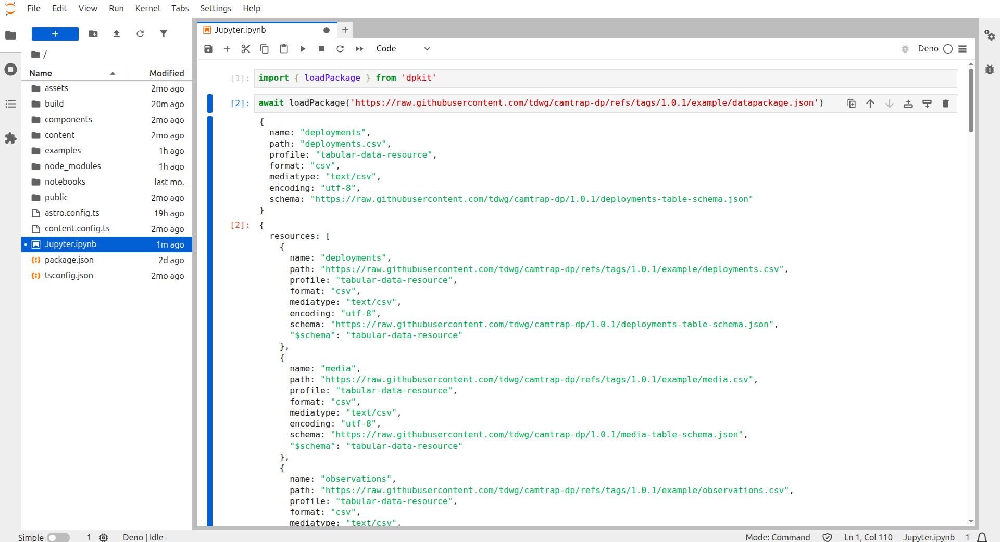

For data scientists and data engineers, [Jupyter Notebooks](https://docs.jupyter.org/en/latest/) provide a powerful and flexible environment for exploring, visualizing, and analyzing data.

## Installation

1. **Install Jupyter:** `pip install jupyterlab` - Installs Jupyter Notebook, a web-based interactive computing environment for data science and data engineering. You can user another UI such as Jupyter CLI or Jupyter Desktop.

1. **Install Deno:** `curl -fsSL https://deno.land/install.sh | sh` - Downloads and installs the Deno runtime required for TypeScript execution in Jupyter notebooks. Visit [Deno](https://deno.com) for official documentation.

1. **Install Deno Jupyter Kernel:** `deno jupyter --install` - Sets up the Deno kernel for Jupyter, enabling TypeScript support within notebooks.

1. **Activate Deno Jupyter Kernel:** `deno jupyter --unstable` - Enables the Deno kernel for Jupyter notebook usage.

## Usage

1. **Run Jupyter Notebooks:** `jupyter-lab` - Launches the Jupyter Notebook server in the current working directory, which allows you to create and run Jupyter notebooks.

1. **Select Deno Kernel in Notebook:** Choose the Deno kernel from your notebook's kernel selection menu. VSCode users may need to install the default Jupyter kernel extensions.

## References

- [Typescript Jupyter Notebooks: How to set them up](https://alex-goff.medium.com/typescript-jupyter-notebooks-how-to-set-them-up-1ab9fd464ea4)
- [Bringing Modern JavaScript to the Jupyter Notebook](https://blog.jupyter.org/bringing-modern-javascript-to-the-jupyter-notebook-fc998095081e)
